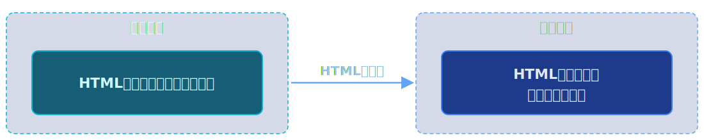
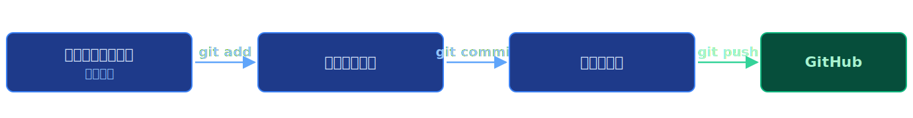

# 第2回: HTML基礎 — TODOアプリの骨格を作る

**Webアプリケーション基礎 2026**

---

## 今日のゴール

HTMLでTODOアプリの構造（骨格）を作る

見た目の装飾（CSS）や動き（JavaScript）はまだ扱いません。
今日はあくまで **「構造」** を作ることに集中します。

---


---

## 今日の流れ

**前半**
- HTMLとは — ブラウザが読み解く「設計図」
- 基本タグ — 見出し、段落、リスト、リンク
- 構造化タグ — div, セマンティックタグ

**後半**
- フォーム要素 — 入力欄、ボタン
- TODOアプリのHTML設計
- Gitの基本操作復習

---


# 前半

## セクション1: HTMLとは

---

## HTMLとは何か？

**HTML = HyperText Markup Language**

- Webページの **構造** を記述するための言語
- プログラミング言語ではなく **マークアップ言語**
  - 「ここは見出し」「ここは段落」「ここはリンク」と **印(マーク)をつける** 言語
- ブラウザが HTML を読み取って、画面に表示する

---

## HTMLはどこで実行される？ - 実行場所を意識しよう



1. サーバーに HTML ファイルが保存されている
2. ブラウザがサーバーに「このページをください」とリクエスト（第1回で学んだHTTP）
3. サーバーが HTML ファイルを送る
4. **ブラウザが HTML を解釈して画面を描画する** ← ここが実行場所！

HTMLは **ブラウザ（クライアント側）** で解釈・表示されます。

---

## HTMLの基本構造

すべてのHTMLファイルは、以下の基本構造を持ちます。

```html
<!DOCTYPE html>
<html lang="ja">
<head>
    <meta charset="UTF-8">
    <meta name="viewport" content="width=device-width, initial-scale=1.0">
    <title>ページのタイトル</title>
</head>
<body>
    ここに表示する内容を書く
</body>
</html>
```

---

## 基本構造の各部分の意味

| 要素 | 役割 |
|------|------|
| `<!DOCTYPE html>` | 「これはHTML5の文書です」という宣言 |
| `<html lang="ja">` | HTML文書全体を囲む。`lang="ja"` は日本語を示す |
| `<head>` | ページの **メタ情報**（画面には表示されない） |
| `<meta charset="UTF-8">` | 文字コード指定（日本語を正しく表示するため） |
| `<meta name="viewport" ...>` | スマホ対応のための設定 |
| `<title>` | ブラウザのタブに表示されるタイトル |
| `<body>` | **画面に表示される内容** をここに書く |

---

## タグの書き方 - 基本ルール

HTMLは **タグ** で構成されます。

```html
<タグ名>内容</タグ名>
```

- **開始タグ**: `<タグ名>`
- **終了タグ**: `</タグ名>` （スラッシュがつく）
- **内容**: 開始タグと終了タグの間に書く

例:
```html
<h1>これは見出しです</h1>
<p>これは段落です</p>
```

一部のタグは終了タグが不要です（例: `<br>`, ``, `<meta>`）。

---

## 【実習1】HTMLファイルをブラウザで開こう（5分）

`session02/exercise/` フォルダの `index.html` をダウンロードして、ブラウザで開いてみましょう。

**手順:**
1. vscode上で `session02/exercise/index.html` を右クリック → 「Download」を選択
2. ダウンロードした `index.html` をブラウザで開く
   - ファイルをダブルクリック、またはブラウザにドラッグ＆ドロップ
3. 表示された内容を確認する

HTMLファイルはサーバーがなくても、ブラウザで直接開いて表示を確認できます。

---

## 【実習2】最初のHTMLファイルを作ろう（10分）

`session02/exercise/` フォルダの `index.html`（スターターファイル）を開き、基本構造を確認しましょう。

```html
<!DOCTYPE html>
<html lang="ja">
<head>
    <meta charset="UTF-8">
    <title>はじめてのHTML</title>
</head>
<body>
    <h1>はじめてのWebページ</h1>
    <p>HTMLの勉強を始めました！</p>
</body>
</html>
```

---

## 【実習2】最初のHTMLファイルを作ろう（続き）

1. vscode上で表示を確認する
2. `<title>` や `<h1>` の文字を変更して、変化を確認する

---


# 前半

## セクション2: 基本タグ

---

## 見出しタグ: h1 〜 h6

見出しには6段階のレベルがあります。

```html
<h1>最も大きい見出し（ページのタイトル）</h1>
<h2>2番目に大きい見出し（セクションタイトル）</h2>
<h3>3番目の見出し（サブセクション）</h3>
<h4>4番目の見出し</h4>
<h5>5番目の見出し</h5>
<h6>最も小さい見出し</h6>
```

- `h1` はページに **1つだけ** 使うのが基本
- 数字が小さいほど重要度が高い
- 見出しの順番を飛ばさない（h1の次にh3を使わない）

---

## 段落タグ: p / 改行・水平線: br, hr

```html
<!-- 段落 -->
<p>これは1つ目の段落です。段落は自動的に前後に余白ができます。</p>
<p>これは2つ目の段落です。長い文章はp要素で囲みます。</p>

<!-- 改行 -->
<p>1行目<br>2行目</p>

<!-- 水平線（区切り線） -->
<hr>
```

- `<p>`: 段落（paragraph）。文章のまとまりを表す
- `<br>`: 改行（break）。終了タグなし
- `<hr>`: 水平線（horizontal rule）。終了タグなし

---

## リンクタグ: a

他のページへのリンクを作ります。

```html
<a href="https://www.google.com">Googleへ移動</a>
```

- `href` は **属性（attribute）** と呼ばれる
- 属性はタグに追加情報を与える
- `href` の値にリンク先のURLを指定する

```html
<!-- 別タブで開く場合 -->
<a href="https://github.com" target="_blank">GitHub（別タブで開く）</a>

<!-- 同じサイト内のページへのリンク -->
<a href="about.html">自己紹介ページ</a>
```

---

## 画像タグ: img

画像を表示します。

```html

```

- `src`: 画像ファイルのパス（URL）
- `alt`: 画像が表示できないときの代替テキスト（必須）
  - 視覚障害の方が使うスクリーンリーダーでも読み上げられる

```html
<!-- URLで指定 -->


<!-- サイズ指定 -->

```

---

## リストタグ: ul, ol, li

リスト（箇条書き）を作成します。

```html
<!-- 順序なしリスト（箇条書き） -->
<ul>
    <li>りんご</li>
    <li>みかん</li>
    <li>ぶどう</li>
</ul>

<!-- 順序ありリスト（番号付き） -->
<ol>
    <li>卵を割る</li>
    <li>混ぜる</li>
    <li>焼く</li>
</ol>
```

- `<ul>`: Unordered List（順序なし） → ・で表示
- `<ol>`: Ordered List（順序あり） → 1. 2. 3. で表示
- `<li>`: List Item（リストの各項目）

---

## タグの入れ子構造（ネスト）

タグの中にタグを入れることができます。これを **入れ子（ネスト）** と呼びます。

```html
<ul>
    <li>
        <a href="https://www.google.com">Google</a>
    </li>
    <li>
        <a href="https://github.com">GitHub</a>
    </li>
</ul>
```

ルール:
- 開いたタグは、内側のタグをすべて閉じてから閉じる
- **正しい**: `<ul><li>項目</li></ul>`
- **間違い**: `<ul><li>項目</ul></li>` （閉じる順番が逆）

インデント（字下げ）を使うと、構造が見やすくなります。

---

## 【実習3】自己紹介ページを作ろう（10分）

`index.html` を編集して、以下の要素を含む自己紹介ページを作ってください。

1. **名前の見出し**（h1タグ）
2. **自己紹介文**（pタグで2〜3文）
3. **趣味のリスト**（ulタグとliタグ）
4. **好きなWebサイトへのリンク**（aタグ）
5. （余裕があれば）画像を1つ追加

---

## 【実習3】自己紹介ページを作ろう（参考例）

```html
<h1>山田太郎の自己紹介</h1>
<p>情報学部の1年生です。Webアプリに興味があります。</p>
<h2>趣味</h2>
<ul>
    <li>プログラミング</li>
    <li>読書</li>
    <li>映画鑑賞</li>
</ul>
<a href="https://github.com">GitHubのプロフィール</a>
```

---


# 前半

## セクション3: 構造化タグ

---

## div と span

HTMLの内容をグループ化するためのタグです。

```html
<!-- div: ブロック要素のグループ化（縦に積み重なる） -->
<div>
    <h2>セクション1</h2>
    <p>この部分をひとまとめにしたい</p>
</div>

<!-- span: インライン要素のグループ化（横に並ぶ） -->
<p>今日の天気は<span>晴れ</span>です。</p>
```

| タグ | 種類 | 用途 |
|------|------|------|
| `<div>` | ブロック要素 | 大きなまとまりを囲む。前後に改行が入る |
| `<span>` | インライン要素 | 文章の一部を囲む。前後に改行が入らない |

`div` と `span` 自体には見た目の変化はありません。
後で学ぶ CSS でスタイルを当てるときに使います。

---

## セマンティックタグとは？

**セマンティック(semantic)** = 「意味のある」

HTMLタグで内容の **意味・役割** を明示するタグです。

```
なぜ必要？
┌───────────────────────────────────────┐
│  <div> だけで書くと...                  │
│  <div> ← ヘッダー？ 本文？ 何か不明   │
│    <div> ← サイドバー？ 記事？        │
│    </div>                             │
│  </div>                               │
│                                       │
│  セマンティックタグを使うと...          │
│  <header> ← ヘッダーだと一目でわかる   │
│    <main> ← メインコンテンツだとわかる │
│    </main>                            │
│  </header>                            │
└───────────────────────────────────────┘
```

---

## 主なセマンティックタグ

| タグ | 意味 | 使いどころ |
|------|------|-----------|
| `<header>` | ヘッダー | ページやセクションの先頭部分 |
| `<nav>` | ナビゲーション | メニュー、リンク集 |
| `<main>` | メインコンテンツ | ページの主要な内容（1ページに1つ） |
| `<section>` | セクション | 内容のまとまり |
| `<article>` | 記事 | 独立した記事やコンテンツ |
| `<aside>` | 補足情報 | サイドバー、補足説明 |
| `<footer>` | フッター | ページやセクションの末尾部分 |

---

## セマンティックタグの使用例

```html
<body>
  <header>
    <h1>山田太郎のポートフォリオ</h1>
    <nav>
      <a href="#about">自己紹介</a>
      <a href="#hobby">趣味</a>
    </nav>
  </header>
  <main>
    <section id="about">
      <h2>自己紹介</h2>
      <p>情報学部の1年生です。</p>
    </section>
    <section id="hobby">
      <h2>趣味</h2>
      <ul><li>プログラミング</li></ul>
    </section>
  </main>
  <footer>
    <p>&copy; 2026 山田太郎</p>
  </footer>
</body>
```

---

## 開発者ツールの Elements タブ

ブラウザの開発者ツール（F12キー）で HTML の構造を確認できます。

**Elementsタブでできること:**
- HTML要素のツリー構造を確認
- 要素にカーソルを合わせると、画面上でハイライトされる
- 要素をクリックして、そのHTMLを確認
- リアルタイムにHTMLを編集して、プレビューできる（一時的）

**操作手順:**
1. ブラウザで F12 キーを押す（または右クリック → 「検証」）
2. Elements タブを選択
3. 左上の矢印アイコンをクリック
4. ページ上の要素をクリック → 対応するHTMLがハイライトされる

---

## 【実習4】セマンティックタグで構造化しよう（10分）

実習2で作った自己紹介ページを、セマンティックタグで構造化してください。

1. ページ全体を `<header>`, `<main>`, `<footer>` で区切る
2. 自己紹介と趣味をそれぞれ `<section>` で囲む
3. フッターに著作権表示を追加
4. 開発者ツール（F12）の Elements タブで構造を確認する

---

## 【実習4】セマンティックタグで構造化しよう（参考例）

```html
<header>
    <h1>名前</h1>
</header>
<main>
    <section>
        <h2>自己紹介</h2>
        <p>自己紹介文</p>
    </section>
    <section>
        <h2>趣味</h2>
        <ul>...</ul>
    </section>
</main>
<footer>
    <p>&copy; 2026 あなたの名前</p>
</footer>
```

---


# 後半

## セクション4: フォーム要素

---

## フォーム要素とは？

ユーザーからの **入力を受け取る** ためのHTML要素です。

Webアプリではフォームが頻繁に使われます:
- ログインフォーム（ID・パスワード入力）
- 検索ボックス
- お問い合わせフォーム
- **TODOの入力欄** ← 今日のゴール！

---

## form タグ

フォーム全体を囲むタグです。

```html
<form>
    <!-- フォームの中身をここに書く -->
</form>
```

`form` タグの属性:
- `action`: データの送信先URL
- `method`: 送信方法（GET または POST）

```html
<form action="/submit" method="POST">
    <!-- 送信ボタンを押すと /submit にPOSTリクエストが送られる -->
</form>
```

今の段階ではサーバーがないので、送信先は指定しません。
後の回（第5回以降）でサーバーを作ったときに使います。

---

## input タグ - テキスト入力

ユーザーが文字を入力するフィールドを作ります。

```html
<!-- テキスト入力 -->
<input type="text" placeholder="名前を入力">

<!-- メールアドレス入力 -->
<input type="email" placeholder="example@mail.com">

<!-- パスワード入力（入力が●で隠れる） -->
<input type="password" placeholder="パスワード">
```

主な属性:
| 属性 | 意味 |
|------|------|
| `type` | 入力の種類（text, email, password, number など） |
| `placeholder` | 入力前に薄く表示されるヒント文字 |
| `id` | 要素を一意に識別するためのID |
| `name` | サーバーに送信するときのデータ名 |

---

## input タグ - チェックボックス

選択肢を提供します。

```html
<!-- チェックボックス -->
<input type="checkbox" id="task1">
<label for="task1">タスク1を完了</label>

<input type="checkbox" id="task2" checked>
<label for="task2">タスク2を完了（初期状態でチェック済み）</label>
```

- `type="checkbox"`: チェックボックスを表示
- `checked`: 初期状態でチェックを入れる
- TODOアプリでは、タスクの完了/未完了に使います

---

## label タグ

入力欄にラベル（説明文）を関連付けます。

```html
<!-- for属性でinputのidを指定 -->
<label for="username">名前:</label>
<input type="text" id="username">

<!-- label で input を囲む方法もある -->
<label>
    メール:
    <input type="email">
</label>
```

`label` を使う利点:
- ラベルをクリックすると、対応する入力欄にフォーカスが移る
- チェックボックスの場合、ラベルをクリックしてもチェックできる
- アクセシビリティ（スクリーンリーダー対応）の向上

---

## button タグ

クリック可能なボタンを作ります。

```html
<!-- 通常のボタン -->
<button type="button">クリック</button>

<!-- 送信ボタン（form内で使用） -->
<button type="submit">送信</button>
```

| type | 動作 |
|------|------|
| `button` | クリックしても何も起きない（JSで動作を定義） |
| `submit` | form内のデータをサーバーに送信（ページがリロードされる） |

`type="submit"` のボタンを押すと **ページがリロード** されます。
これは後の回でJavaScriptを使って制御します。

---

## フォームの完成例

```html
<form>
    <div>
        <label for="name">名前:</label>
        <input type="text" id="name" placeholder="山田太郎">
    </div>
    <div>
        <label for="email">メール:</label>
        <input type="email" id="email" placeholder="example@mail.com">
    </div>
    <div>
        <label>
            <input type="checkbox"> メルマガを受け取る
        </label>
    </div>
    <button type="submit">送信</button>
</form>
```

---

## 【実習5】簡単なフォームを作ろう（10分）

以下の要素を含むフォームを `index.html` の中に追加してください。

1. **名前の入力欄**（テキスト入力 + ラベル）
2. **メールアドレスの入力欄**（email入力 + ラベル）
3. **送信ボタン**

手順:
- `<section>` で囲んで「お問い合わせ」セクションとして追加
- 各入力欄に `label` をつける
- `placeholder` でヒントを表示する
- 送信ボタンを押すとページがリロードされることを確認する
  - これは `type="submit"` の標準動作です
  - 第4回で JavaScript を使ってこの動作を制御します

---


# 後半

## セクション5: TODOアプリのHTML設計

---

## TODOアプリに必要な要素を考えよう

TODOアプリの画面を見て、必要なHTML要素を洗い出します。

```
┌──────────────────────────────────┐
│  TODO App              ← タイトル（h1）
│                                  │
│  [新しいTODOを入力] [追加]        │
│   ↑ テキスト入力     ↑ ボタン    │
│                                  │
│  □ 買い物に行く       ← チェックボックス + テキスト
│  □ レポートを書く     ← チェックボックス + テキスト
│  □ 本を読む          ← チェックボックス + テキスト
│                       ↑ リスト（ul + li）
└──────────────────────────────────┘
```

---

## TODOアプリの HTML 構造設計

```html
<header>
    <h1>TODO App</h1>
</header>
<main>
    <form id="todo-form">
        <input type="text" id="todo-input"
               placeholder="新しいTODOを入力">
        <button type="submit">追加</button>
    </form>
    <ul id="todo-list">
        <li>
            <input type="checkbox">
            <span>買い物に行く</span>
        </li>
    </ul>
</main>
```

- `<form>` で入力エリアを、`<ul>` でTODOリスト表示エリアを構成

---

## なぜ id をつけるのか？

```html
<input type="text" id="todo-input">
<ul id="todo-list">
```

**id** は要素に一意の名前をつけます。

今の段階では意味がなく見えますが、後の回で重要になります:

- **第3回（CSS）**: `#todo-input { ... }` でスタイルを適用
- **第4回（JavaScript）**: `document.getElementById("todo-input")` で要素を取得し操作

id は **将来の JavaScript や CSS のための目印** だと思ってください。

---

## 各TODO項目の構造

1つのTODOは以下の構造にします:

```html
<li>
    <input type="checkbox">
    <span>TODOのテキスト</span>
</li>
```

| 要素 | 役割 |
|------|------|
| `<li>` | リストの1項目 |
| `<input type="checkbox">` | 完了/未完了の切り替え |
| `<span>` | TODOのテキスト |

今はHTMLに直接書きますが、第4回では JavaScript で動的に生成します。

---

## 【実習6】TODOアプリの HTML を作ろう（10分）

`session02/exercise/todo.html` を編集してTODOアプリを完成させてください。

1. `todo.html` のスターターファイルを開く（ヒント付きの穴埋め形式）
2. 以下を実装する:
   - **アプリタイトル**（h1）
   - **入力フォーム**: テキスト入力欄 + 追加ボタン
   - **TODOリスト**: ダミーのTODO項目を3つ以上
     - 各項目にチェックボックスとテキスト
3. vscode上で表示して確認する
4. 開発者ツールの Elements タブで構造を確認する

完成例は `session02/sample/todo-complete.html` を参考にしてください。

---


# 後半

## セクション6: Gitの基本操作復習

---

## Gitの操作 - おさらい

第1回で学んだ Git の基本操作を復習します。



| コマンド | 意味 | 比喩 |
|---------|------|------|
| `git add ファイル名` | ステージングに追加 | 「これを記録対象にする」と選ぶ |
| `git commit -m "メッセージ"` | 変更を記録 | セーブポイントを作る |
| `git push` | GitHubにアップロード | クラウドに保存する |

---

## git diff で変更を確認する

コミットする前に、何が変わったか確認しましょう。

```bash
# まだステージングしていない変更を確認
git diff

# ステージング済みの変更を確認
git diff --staged
```

出力の見方:
```diff
+ <h1>TODO App</h1>      ← 追加された行（緑色）
- <h1>Hello World</h1>   ← 削除された行（赤色）
```

`+` が追加、`-` が削除を意味します。

---

## git status で状態を確認

現在の状態を確認するコマンドです。

```bash
git status
```

出力例:
```
On branch main
Changes not staged for commit:
  modified:   session02/exercise/index.html   ← 変更されたファイル

Untracked files:
  session02/exercise/todo.html                ← 新しく作ったファイル
```

- **modified**: 既存ファイルが変更された
- **Untracked**: まだ Git で管理されていない新しいファイル

---

## コミットメッセージの書き方

良いコミットメッセージの例:

```bash
# 良い例: 何をしたかが明確
git commit -m "TODOアプリのHTMLを作成"
git commit -m "自己紹介ページにフォームを追加"

# 悪い例: 曖昧
git commit -m "更新"
git commit -m "修正"
```

ポイント:
- **何をしたか** が分かるように書く
- 日本語でも英語でもOK
- 短く、具体的に（1行で収まるように）

---

## GitHubで変更履歴を確認する

Push した後、GitHub の Web サイトで変更履歴が見られます。

1. GitHub のリポジトリページを開く
2. 「commits」リンクをクリック
3. 各コミットのメッセージと変更内容が確認できる

これにより:
- いつ、何を変更したかの記録が残る
- 過去のバージョンに戻すこともできる
- チーム開発では誰が何を変更したかが分かる

---

## 【実習7】Git で変更を記録しよう（10分）

今日作成・編集したファイルを Git で記録しましょう。

```bash
git status                                # 1. 現在の状態を確認
git diff                                  # 2. 変更内容を確認
git add session02/exercise/index.html     # 3. ステージングに追加
git add session02/exercise/todo.html
git commit -m "第2回: HTMLでTODOアプリの骨格を作成"  # 4. コミット
git push                                  # 5. GitHubにプッシュ
```

GitHubのリポジトリページで、自分のコミットが反映されているか確認してください。

---

## 今日のまとめ

| 学んだこと | 内容 |
|-----------|------|
| HTML とは | ブラウザが解釈する構造の設計図 |
| 基本タグ | h1-h6, p, a, img, ul/ol/li, br, hr |
| 構造化タグ | div, span, header, main, footer, section |
| フォーム要素 | form, input, button, label |
| Git 操作 | add, commit, push, diff, status |

---

## 今日のTODOアプリの進捗

**できたこと:**
- HTMLでTODOアプリの構造を作成
- 入力欄、ボタン、リスト表示を実装

**まだできないこと:**
- 見た目が整っていない → **第3回（CSS）** で対応
- ボタンを押しても何も起きない → **第4回（JavaScript）** で対応

---

## 次回予告

**第3回: CSS基礎 — TODOアプリの見た目を整える**

- CSSの3つの適用方法
- セレクタとプロパティ
- ボックスモデル
- Flexboxレイアウト
- TODOアプリを綺麗にデザイン
- レスポンシブデザイン入門

TODOアプリに見た目を加えて、使いやすいデザインにしていきます！

---

## 提出物

実習で穴埋め・実装を完了させたファイルをフォームから提出してください:

1. `index.html` のGitHubのURL
   - 例: `https://github.com/ユーザー名/リポジトリ名/blob/main/session02/exercise/index.html`
2. `todo.html` のGitHubのURL
   - 例: `https://github.com/ユーザー名/リポジトリ名/blob/main/session02/exercise/todo.html`
